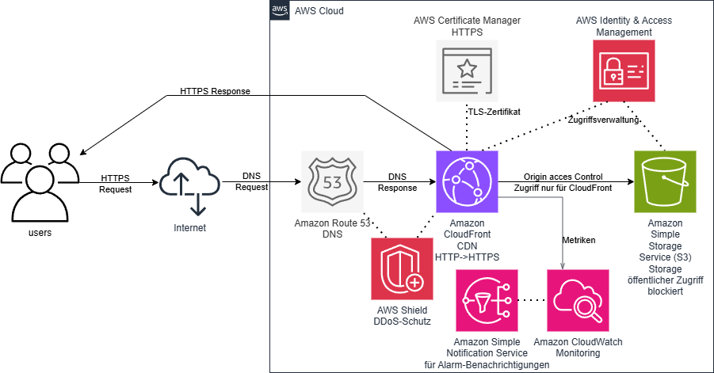

# Cloud Programming - Infrastructure as Code

Vollautomatisierte Terraform-Infrastruktur für das Hosting einer statischen Website auf AWS mit CloudFront CDN, S3-Speicher, automatisiertem Monitoring und CI/CD Integration.

---

## 📋 Inhaltsverzeichnis

- [Überblick](#überblick)
- [Architektur](#architektur)
- [Voraussetzungen](#voraussetzungen)
- [Quick Start](#quick-start)
- [Detaillierter Setup](#detaillierter-setup)
- [Deployment](#deployment)
- [Automatisierte Deployments (GitHub Actions)](#automatisierte-deployments-github-actions)
- [Monitoring & Alarme](#monitoring--alarme)
- [Konfiguration](#konfiguration)
- [Outputs & CloudFront-URL](#outputs--cloudfront-url)
- [Cleanup](#cleanup)
- [Troubleshooting](#troubleshooting)
- [Best Practices](#best-practices)

---

## Überblick

Dieses Terraform-Projekt stellt eine hoch verfügbare, global erreichbare, automatisch skalierbare, kosteneffiziente und sichere Website-Hosting-Infrastruktur auf AWS bereit:

- **S3 Bucket**: Privater Speicher für Website-Dateien
- **CloudFront CDN**: Globale Content Delivery mit HTTPS und Origin Access Control
- **CloudWatch**: Umfassendes Monitoring mit Alarmen für Fehler und Anomalien
- **SNS**: Alarm-Benachrichtigungen via E-Mail/SMS
- **IAM**: Sichere Rollen für Terraform-Deployment und GitHub Actions CI/CD
- **GitHub OIDC**: Passwortloser Zugriff für automatisierte Deployments

**Zielgruppe**: DevOps Teams, die schnell eine sichere, überwachte Website-Infrastruktur bereitstellen möchten.

### Repo-Inhalt
- **IaC/**: Ordner mit allen Terraform-Dokumenten
- **Webseite/**: Ordner mit allen Dateien und Inhalten der Website
- **.github/workflows/**: Ordner der den GitHub-Workflow für den Deploy enthält

### Ordnerstruktur der IaC
- **main.tf**
- **provider.tf**
- **s3.tf**
- **cloudfront.tf**
- **iam.tf**
- **cloudwatch-alarme.tf**
- **cloudwatch-dashboard.tf**
- **sns.tf**
- **variablen-tf**
- **outputs.tf**
- **terraform.tfvars.example**
---

## Architektur

```

┌─────────────────────────────────────────────────────────────────┐
│                        End-User (Internet)                      │
└────────────────┬────────────────────────────────────────────────┘
                 │
                 ▼
         ┌──────────────────┐
         │   CloudFront CDN │ (HTTPS, OAC)
         │  (Global Edge)   │
         └────────┬─────────┘
                  │
                  ▼
         ┌──────────────────┐
         │     S3 Bucket    │ (Private)
         │  (Origin)        │
         └────────┬─────────┘
                  │
     ┌────────────┴────────────┐
     ▼                         ▼
┌─────────────┐         ┌──────────────────┐
│  CloudWatch │         │   SNS Topics     │
│  Alarme     │◄───────►│ Notifications    │
└─────────────┘         └──────────────────┘
     │
     ▼
┌──────────────────┐
│ CloudWatch Dash  │
│ (Monitoring)     │
└──────────────────┘
```

### Deployment-Flow

```
┌──────────────┐      ┌──────────────┐      ┌─────────────────┐
│ GitHub Repo  │─────►│GitHub Actions│─────►│   AWS Account   │
│ (Code Push)  │      │(OIDC Auth)   │      │ (Terraform Plan │
└──────────────┘      └──────────────┘      │  & Apply)       │
                                            └─────────────────┘
```

---

## Voraussetzungen

### Lokal (für manuelles Deployment)

1. **Terraform** ≥ 1.0
   ```bash
   terraform --version
   ```

2. **AWS CLI** v2
   ```bash
   aws --version
   ```

3. **AWS Credentials** konfiguriert
   ```bash
   aws configure
   ```
   Oder via `AWS_ACCESS_KEY_ID` / `AWS_SECRET_ACCESS_KEY` Umgebungsvariablen

### Für GitHub Actions (automatisiertes Deployment)

1. **GitHub OIDC Provider** in deinem AWS Account registriert
2. **GitHub Secrets** konfiguriert (siehe [Automatisierte Deployments](#automatisierte-deployments-github-actions))

### AWS Account

- IAM-Benutzer mit entsprechenden Berechtigungen
- (Oder: IAM-Rolle `TerraformRolle` aus diesem Projekt verwenden)

---

## Quick Start

### 1. Repository klonen

```bash
git clone <repo-url>
cd CloudProgrammingCode/IaC
```

### 2. Konfiguration anpassen

```bash
# Vorlage kopieren
cp terraform.tfvars.example terraform.tfvars

# Mit deinem Lieblingseditor bearbeiten
nano terraform.tfvars
# ODER
code terraform.tfvars
```

**Kritische Variablen, die du ändern MUSST:**
- `bucket_name`: Eindeutiger S3-Bucket-Name (global!)
- `terraform_admin_user_arn`: Deine Admin-User-ARN
- `github_repo`: Dein GitHub-Repository (owner/repo)
- `github_oidc_provider_arn`: ARN deines GitHub OIDC Providers

### 3. Terraform initialisieren

```bash
terraform init
```

### 4. Plan überprüfen

```bash
terraform plan -out=tfplan
```

Überprüfe die geplanten Änderungen sorgfältig.

### 5. Infrastruktur bereitstellen

```bash
terraform apply tfplan
```

### 6. Outputs anzeigen

```bash
terraform output
```

Die CloudFront-URL unter `cloudfront_domain_name` ist deine Website-URL.

---

## 🔧 Detaillierter Setup

### Schritt 1: Repository vorbereiten

```bash
git clone <repo-url>
cd CloudProgrammingCode/IaC
```

### Schritt 2: AWS Account vorbereiten

#### Option A: Mit existierendem Admin-User

```bash
# 1. Deine AWS Account ID ermitteln
aws sts get-caller-identity

# 2. Deinen Admin-User ARN ermitteln
aws iam get-user --user-name AdminUser
# Kopiere die "Arn" aus dem Output
```

#### Option B: Neue IAM-Rolle via Terraform

Falls du die `TerraformRolle` aus diesem Projekt verwenden möchtest:
- Sie wird automatisch erstellt
- Dein Admin-User kann sie annehmen (via `aws sts assume-role`)

### Schritt 3: GitHub OIDC Provider einrichten (falls GitHub Actions nutzen)

```bash
# Erstelle den OIDC Provider (einmalig pro AWS Account)
aws iam create-open-id-connect-provider \
  --url https://token.actions.githubusercontent.com \
  --client-id-list sts.amazonaws.com \
  --thumbprint-list <THUMBPRINT>

# Den Thumbprint findest du unter:
# https://github.blog/changelog/2022-01-13-github-actions-update-on-oidc-based-deployments-for-aws/
# Standardwert: 6938fd4d98bab03faadb97b34396831e3780aea1
```

Oder nutze die Terraform-Vorlage aus `iam.tf` für automatisierte Einrichtung.

### Schritt 4: Variables anpassen

```bash
cp terraform.tfvars.example terraform.tfvars
```

**In `terraform.tfvars` ändern:**

```hcl
# MUSS GEÄNDERT WERDEN
bucket_name = "mein-eindeutiger-bucketname"
terraform_admin_user_arn = "arn:aws:iam::123456789012:user/admin"
github_repo = "meinusername/mein-repo"
github_oidc_provider_arn = "arn:aws:iam::123456789012:oidc-provider/token.actions.githubusercontent.com"

# OPTIONAL - nur wenn du andere Werte möchtest
aws_region = "eu-central-1"
cloudfront_price_class = "PriceClass_100"  # Günstiger, aber weniger Regionen
```

### Schritt 5: Terraform initialisieren

```bash
terraform init
```

**Output sollte sein:**
```
Initializing the backend...
Initializing provider plugins...
Terraform has been successfully configured!
```

### Schritt 6: Plan & Review

```bash
terraform plan -out=tfplan
```

Überprüfe alle geplanten Ressourcen. Output zeigt:
- S3 Bucket
- CloudFront Distribution
- IAM Rollen & Policies
- CloudWatch Alarme & SNS Topics
- etc.

### Schritt 7: Anwenden

```bash
terraform apply tfplan
```

** Erwartet ~5-10 Minuten für CloudFront Distribution**

---

## Deployment

### Website-Dateien uploaden

Nachdem die Infrastruktur bereitgestellt ist, lade deine Website-Dateien hoch:

#### Option 1: Manuell via AWS Console

1. Öffne S3 Console
2. Gehe zu deinem Bucket (Name aus Outputs)
3. Lade `index.html` und andere Dateien hoch

#### Option 2: Via AWS CLI

```bash
# Einzelne Datei
aws s3 cp index.html s3://dein-bucket-name/

# Ganzes Verzeichnis
aws s3 sync ./Webseite/ s3://dein-bucket-name/
```

#### Option 3: GitHub Actions (empfohlen)

Siehe [Automatisierte Deployments](#automatisierte-deployments-github-actions)

### CloudFront Cache invalidieren

Nach dem Upload ist der Cache zu invalidieren, damit neue Inhalte sofort sichtbar sind:

```bash
# CloudFront Distribution ID ermitteln
DIST_ID=$(terraform output -raw cloudfront_distribution_id)

# Alle Dateien invalidieren
aws cloudfront create-invalidation \
  --distribution-id $DIST_ID \
  --paths "/*"
```

---

## Automatisierte Deployments (GitHub Actions)

Dieses Projekt unterstützt vollautomatisierte Website-Deployments via GitHub Actions.

### Voraussetzungen

1. **OIDC Provider eingerichtet** (siehe [Schritt 3](#schritt-3-github-oidc-provider-einrichten-falls-github-actions-nutzen))
2. **GitHub Secrets konfiguriert**:
   - `AWS_ROLE_ARN`: ARN der GitHub Actions Role (aus Terraform Outputs)
   - `AWS_REGION`: z.B. `eu-central-1`

### GitHub Secrets einrichten

```bash
# 1. GitHub CLi installieren (falls nicht vorhanden)
# https://cli.github.com/

# 2. Terraform Outputs ermitteln
terraform output

# 3. Secrets setzen
gh secret set AWS_ROLE_ARN -b "<github_role_arn aus Outputs>"
gh secret set AWS_REGION -b "eu-central-1"
```

Oder manuell in GitHub:
1. Repository → Settings → Secrets and variables → Actions
2. "New repository secret" hinzufügen:
   - Name: `AWS_ROLE_ARN`
   - Value: `arn:aws:iam::123456789012:role/GitHubRolle`
3. Wiederholen für `AWS_REGION`

### Workflow-Beispiel (.github/workflows/deploy.yml)

```yaml
name: Deploy Website

on:
  push:
    branches: [main]
    paths:
      - 'Webseite/**'

permissions:
  id-token: write
  contents: read

jobs:
  deploy:
    runs-on: ubuntu-latest
    steps:
      - uses: actions/checkout@v3

      - name: Configure AWS credentials
        uses: aws-actions/configure-aws-credentials@v2
        with:
          role-to-assume: ${{ secrets.AWS_ROLE_ARN }}
          aws-region: ${{ secrets.AWS_REGION }}

      - name: Upload to S3
        run: |
          S3_BUCKET=$(cd IaC && terraform output -raw s3_bucket_name)
          aws s3 sync ./Webseite/ s3://$S3_BUCKET/ --delete

      - name: Invalidate CloudFront
        run: |
          cd IaC
          DIST_ID=$(terraform output -raw cloudfront_distribution_id)
          aws cloudfront create-invalidation \
            --distribution-id $DIST_ID \
            --paths "/*"
```

**Ergebnis**: Bei jedem Push zu `main` wird die Website automatisch deployed! ✨

---

## Monitoring & Alarme

### CloudWatch Dashboard

Das Projekt erstellt automatisch ein Dashboard mit:
- **4xx Error Rate**: Client-Fehler (z.B. 404 Not Found)
- **5xx Error Rate**: Server-Fehler
- **Requests**: Gesamtanzahl Anfragen
- **Cache Statistics**: Hit/Miss Rate

Dashboard aufrufen:
```bash
# Dashboard-Name ermitteln
terraform output cloudwatch_dashboard_name

# Dann in AWS Console: CloudWatch → Dashboards → [Name]
```

### Alarme & Benachrichtigungen

Folgende Alarme sind automatisch konfiguriert:

| Alarm | Schwellenwert | Aktion |
|-------|---------------|--------|
| 4xx Fehlerquote | > 5% | SNS Email |
| 5xx Fehlerquote | > 1% | SNS Email |
| Requests | > 1000/5min | SNS Email |

**E-Mail-Benachrichtigungen einrichten**:

```bash
# SNS Topic ARN ermitteln
terraform output sns_topic_4xx_arn

# Abonnement erstellen (einmalig in AWS Console)
# SNS → Topics → [Topic-Name] → Create subscription
# - Protocol: Email
# - Endpoint: deine@email.de
# - Confirm subscription link in email
```

### Schwellenwerte anpassen

In `terraform.tfvars`:

```hcl
alarm_threshold_4xx = 5          # in Prozent
alarm_threshold_5xx = 1          # in Prozent
alarm_threshold_requests = 1000  # in 5 Minuten
```

Dann: `terraform apply`

---

## Konfiguration

### Hauptvariablen

Siehe `variablen.tf` für vollständige Liste. Häufig angepasste Variablen:

```hcl
# ========== KRITISCH ==========
bucket_name = "mein-bucket"
terraform_admin_user_arn = "arn:aws:iam::..."
github_repo = "owner/repo"
github_oidc_provider_arn = "arn:aws:iam::..."

# ========== REGIONEN ==========
aws_region = "eu-central-1"           # Haupt-Region
aws_secondary_region = "us-east-1"    # Für CloudWatch Alarme
s3_region = "eu-central-1"

# ========== CLOUDFRONT ==========
cloudfront_price_class = "PriceClass_All"
# Optionen:
# - "PriceClass_100" = Nur USA, Europa, Asien (günstiger)
# - "PriceClass_200" = Wie 100 + USA/Südamerika
# - "PriceClass_All" = Weltweit (teuer, aber schnell überall)

# ========== MONITORING ==========
alarm_threshold_4xx = 5
alarm_threshold_5xx = 1
alarm_threshold_requests = 1000
```

### Neue Variablen hinzufügen

1. In `variablen.tf` definieren:
   ```hcl
   variable "new_var_name" {
     description = "Beschreibung"
     type        = string
     default     = "default_value"
   }
   ```

2. In `terraform.tfvars` optional hinzufügen:
   ```hcl
   new_var_name = "my_value"
   ```

3. In Ressourcen nutzen:
   ```hcl
   resource "..." {
     property = var.new_var_name
   }
   ```

---

## Outputs & CloudFront-URL

Nach erfolgreichem `terraform apply`:

```bash
terraform output
```

Wichtige Outputs:

| Output | Beschreibung | Beispiel |
|--------|-------------|---------|
| `s3_bucket_name` | S3 Bucket Name | `my-bucket` |
| `cloudfront_domain_name` | **Deine Website-URL** | `d123.cloudfront.net` |
| `cloudfront_distribution_id` | Distribution ID | `E123ABC` |
| `terraform_role_arn` | ARN der Terraform-Rolle | `arn:aws:iam::123...` |
| `github_role_arn` | ARN der GitHub Actions-Rolle | `arn:aws:iam::123...` |
| `sns_topic_4xx_arn` | SNS Topic für 4xx Alarme | `arn:aws:sns::...` |

**Website testen**:

```bash
DOMAIN=$(terraform output -raw cloudfront_domain_name)
curl https://$DOMAIN/index.html
```

---

## 🧹 Cleanup

### Infrastruktur löschen

```bash
# Plan anzeigen (was gelöscht wird)
terraform plan -destroy

# Löschen bestätigen
terraform destroy
```

**Warnung**: Dies löscht:
- S3 Bucket (und ALLE Inhalte!)
- CloudFront Distribution
- IAM Rollen/Policies
- CloudWatch Alarme
- SNS Topics

### Nur bestimmte Ressourcen löschen

```bash
# Nur CloudWatch Alarme löschen
terraform destroy -target=aws_cloudwatch_metric_alarm.cf_4xx_alarm
```

### State-File sichern

```bash
# Backup erstellen
cp terraform.tfstate terraform.tfstate.backup
```

---

## Troubleshooting

### Problem: S3 Bucket Name bereits vergeben

```
Error: Error creating S3 bucket: BucketAlreadyExists
```

**Lösung**: In `terraform.tfvars` einen neuen, eindeutigen Namen setzen:
```hcl
bucket_name = "mein-bucket-2024-01"
```

### Problem: IAM User ARN ungültig

```
Error: Error creating IAM role: InvalidInput
```

**Lösung**: Korrekte ARN überprüfen:
```bash
aws iam get-user --user-name AdminUser
# Kopiere die "Arn" aus dem Output
```

### Problem: Terraform kann keine AWS-Credentials finden

```
Error: NoCredentialProviders matched
```

**Lösung**: AWS Credentials konfigurieren:
```bash
# Option 1: AWS CLI konfigurieren
aws configure

# Option 2: Environment Variables
export AWS_ACCESS_KEY_ID="..."
export AWS_SECRET_ACCESS_KEY="..."
export AWS_DEFAULT_REGION="eu-central-1"
```

### Problem: CloudFront Distribution braucht lange

CloudFront kann 5-10 Minuten zum Bereitstellen brauchen. Das ist normal. Mit `aws cloudfront wait` kannst du warten:

```bash
DIST_ID=$(terraform output -raw cloudfront_distribution_id)
aws cloudfront wait distribution-deployed --id $DIST_ID
```

### Problem: Website zeigt 403 Forbidden

**Ursachen**:
1. Datei wurde noch nicht in S3 hochgeladen
2. OAC ist nicht korrekt konfiguriert
3. S3 Public Access Block blockiert (gewollt)

**Lösung**:
```bash
# Datei in S3 hochladen
aws s3 cp index.html s3://dein-bucket/

# CloudFront Cache invalidieren
DIST_ID=$(terraform output -raw cloudfront_distribution_id)
aws cloudfront create-invalidation --distribution-id $DIST_ID --paths "/*"

# Warten und erneut testen
sleep 30
curl https://d123.cloudfront.net/index.html
```

### Problem: GitHub Actions Deployment schlägt fehl

```
Error: Unable to assume role
```

**Lösungsschritte**:
1. OIDC Provider vorhanden?
   ```bash
   aws iam list-open-id-connect-providers
   ```

2. Secrets gesetzt?
   ```bash
   gh secret list
   ```

3. Thumbprint korrekt?
   ```bash
   aws iam get-open-id-connect-provider \
     --open-id-connect-provider-arn arn:aws:iam::123456789012:oidc-provider/token.actions.githubusercontent.com
   ```

---

## Best Practices

### 1. State-File Management

**Lokal (für Development)**:
```bash
# State-File in .gitignore (ist bereits dort)
# ✓ Funktioniert für einzelne Entwickler
```

**Remote (für Team)**:
```bash
# Backends.tf erstellen
terraform {
  backend "s3" {
    bucket         = "terraform-state-bucket"
    key            = "prod/terraform.tfstate"
    region         = "eu-central-1"
    encrypt        = true
    dynamodb_table = "terraform-locks"
  }
}

# Dann: terraform init
```

### 2. Variablenmanagement

- **`terraform.tfvars.example`**: In Git committen (Vorlage)
- **`terraform.tfvars`**: Niemals committen (`.gitignore`)
- **Sensitive Daten**: Nicht in `terraform.tfvars` – nutze AWS Secrets Manager oder Parameter Store

### 3. Sicherheit

**Gut gemacht**:
- S3 Public Access Block aktiviert
- CloudFront OAC (nicht Origin Access Identity)
- Verschlüsslung in transit (HTTPS) und at-rest (S3 SSE)
- IAM Rollen mit beschränkten Permissions

**Zu beachten**:
- `terraform_admin_user_arn` auf Least Privilege prüfen
- SNS Topics verschlüsseln (optional: `kms_master_key_id`)
- CloudFront WAF hinzufügen (optional: `web_acl_id`)

### 4. CI/CD Pipeline

```
Code Push → GitHub Actions → Terraform Plan (Review) → Terraform Apply
```

**Empfohlene Stages**:
1. `terraform init`
2. `terraform fmt -check` (Syntax-Check)
3. `terraform validate` (Validierung)
4. `terraform plan` (Review vor Apply)
5. `terraform apply` (nur auf main/prod)

### 5. Monitoring & Logging

- CloudWatch Logs aktivieren (optional: `log_config` in CloudFront)
- Access Logs in S3 aktivieren (optional: `logging` in S3)
- AWS CloudTrail für Audit Logs

### 6. Tagging-Strategie

```hcl
locals {
  common_tags = {
    Project     = "Cloud-Programming"
    Environment = "production"
    ManagedBy   = "Terraform"
    CreatedAt   = "2024-01-01"
  }
}

resource "aws_s3_bucket" "website" {
  tags = merge(local.common_tags, {
    Name = "Website Bucket"
  })
}
```

### 7. Dokumentation

- Halte dieses README aktuell
- Dokumentiere Custom-Variablen in `variablen.tf`
- Nutze Terraform `description` Felder
- Kommentiere komplexe Ressourcen

---

## Weitere Ressourcen

- [Terraform AWS Provider Docs](https://registry.terraform.io/providers/hashicorp/aws/latest/docs)
- [AWS CloudFront Best Practices](https://docs.aws.amazon.com/AmazonCloudFront/latest/DeveloperGuide/BestPractices.html)
- [GitHub Actions & AWS OIDC](https://github.com/aws-actions/configure-aws-credentials)
- [Terraform State Management](https://developer.hashicorp.com/terraform/language/state)

---

## Support & Fragen

Bei Problemen:
1. Überprüfe [Troubleshooting](#troubleshooting)
2. Schau in Terraform Logs: `TF_LOG=DEBUG terraform apply`
3. Überprüfe AWS CloudTrail für API-Fehler
4. Nutze `terraform state show` um State zu debuggen

---

**Version**: 1.0  
**Zuletzt aktualisiert**: Mai 2024  
**Terraform Version**: ≥ 1.0  
**AWS Provider**: ~> 5.0
